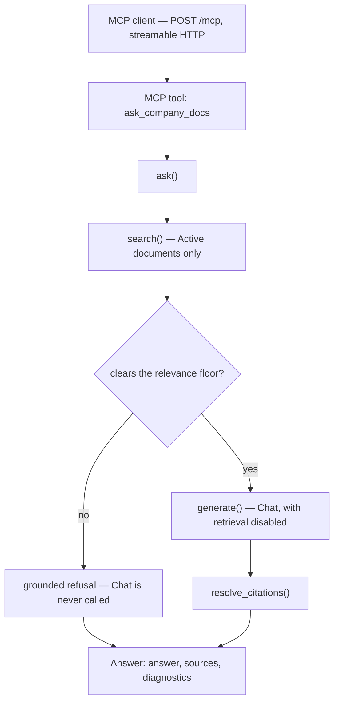
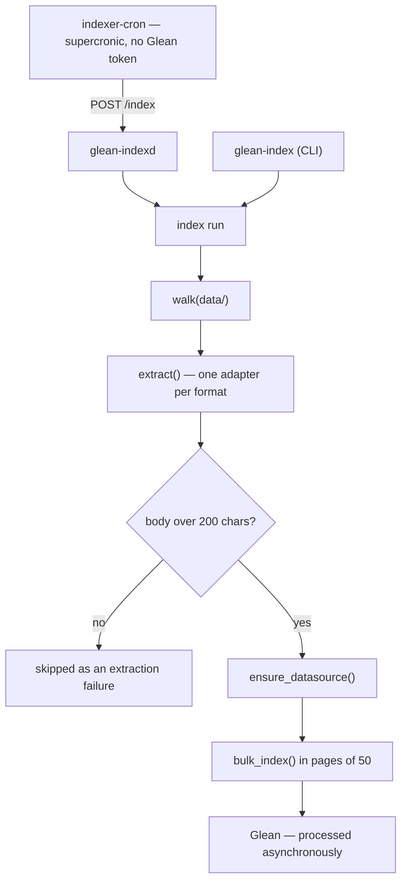

# Architecture

Two paths that share `models.py` and `utils/config.py` and touch nothing else.
`CLAUDE.md` has the reasoning behind the decisions these show.

## Read path — a question arrives

## Write path — extraction and indexing

The two entrypoints share everything below `index run`: `glean-indexd` calls
`indexing.index_once()`, and `glean-index` calls `indexing.run()`, which is the
same sequence plus the per-document table a CLI can print and a server cannot.
Only one run happens at a time — a bulk upload replaces the datasource contents
as a unit, so the service refuses a concurrent request with 409 rather than
letting two runs race over the result.
