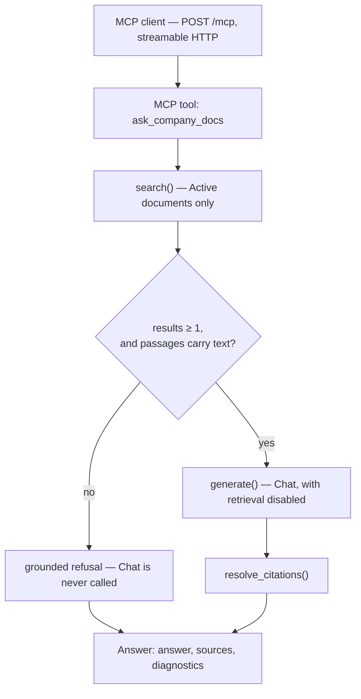
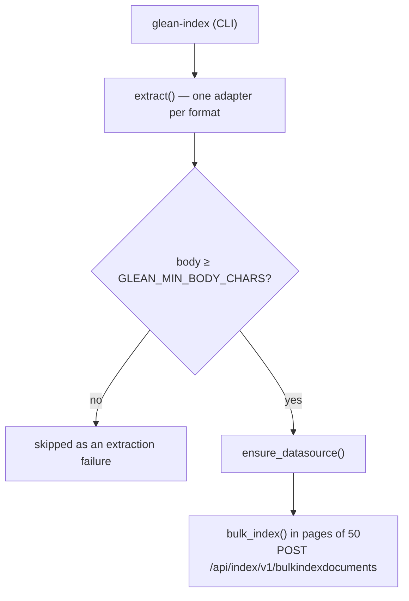

# Halcyon Docs Chatbot

Grounded question answering over a local document corpus, built on Glean's
Indexing, Search and Chat APIs and exposed as a single MCP tool.

## How it works

Two paths that share `models.py` and `utils/config.py` and touch nothing else.

**Read — a question arrives**



**Write — extraction and indexing**



## Configuration

Everything is configured through one `.env` file, read by both the containers
and the Poetry entrypoints.

```bash
cp .env.example .env      # then fill in the tokens
```

| Variable | Used by | Notes |
|---|---|---|
| `GLEAN_INSTANCE` | both | SDK builds `https://{instance}-be.glean.com` |
| `GLEAN_INDEXING_TOKEN` | indexing only | never loaded on the query path |
| `GLEAN_CLIENT_TOKEN` | search + chat | scope Chat/Search, type Global |
| `GLEAN_DATASOURCE` | both | shared sandbox, so this namespaces doc IDs |
| `GLEAN_DOCS_ROOT` | indexing only | corpus root; also the host side of the indexer's bind mount |
| `GLEAN_ACT_AS` | search + chat | email to act as; required for Global tokens |

Optional, with defaults: `GLEAN_DOC_ID_PREFIX` (`halcyon`), `GLEAN_TOP_K` (`5`),
`GLEAN_MAX_SNIPPET_SIZE` (`2000`), `GLEAN_MIN_RESULTS` (`1`),
`GLEAN_MIN_BODY_CHARS` (`200`),
`GLEAN_CHAT_TIMEOUT_MS` (`60000`), `MCP_PORT` (`8000`), `MCP_ALLOWED_HOSTS`.

The two tokens are separated structurally: `Settings.for_indexing()` reads
`GLEAN_INDEXING_TOKEN`, `Settings.for_query()` reads `GLEAN_CLIENT_TOKEN` and
never touches the indexing variable.

## Usage

Three steps, once `.env` is filled in: index the corpus, start the server, point
an MCP client at it. Only step 1 is repeated, whenever the corpus changes.

Compose reads `.env` from the project root automatically, and the required
variables fail fast — a missing one exits with `variable is not set` rather than
starting a half-configured container.

### 1. Index the corpus

The indexer is a separate compose service (the write path) behind the `index`
profile, so it never starts with the server. Run it on demand:

```bash
docker compose run --rm indexer                         # extract and push to Glean
```
Indexing is asynchronous. The command returns once Glean has accepted the
documents, and they stay unsearchable for several minutes after that. Add
`--process-now` to ask Glean to process immediately — rate limited to once per
three hours per datasource.

Re-running is idempotent: the bulk upload replaces the datasource contents as a
unit. The corpus is bind-mounted read-only from `GLEAN_DOCS_ROOT`, so editing a
document on the host and re-running picks it up with no rebuild.

### 2. Start the MCP server

```bash
docker compose up --build          # foreground, logs to the terminal
docker compose up -d --build       # background
```

### 3. Connect an MCP client

The client needs the URL and nothing else — the Glean token lives with the
server, not the client.

**Claude Code**

```bash
claude mcp add --transport http glean-company-docs http://127.0.0.1:8000/mcp
```

Then `/mcp` inside Claude Code lists the server and its one tool.

**Cursor** — `~/.cursor/mcp.json` (or `.cursor/mcp.json` in a project):

```json
{
  "mcpServers": {
    "glean-company-docs": {
      "type": "http",
      "url": "http://127.0.0.1:8000/mcp"
    }
  }
}
```

**Claude Desktop** — Settings → Connectors → Add custom connector, with the same
URL. On a build that only speaks stdio, bridge it:

```json
{
  "mcpServers": {
    "glean-company-docs": {
      "command": "npx",
      "args": ["-y", "mcp-remote", "http://127.0.0.1:8000/mcp"]
    }
  }
}
```

Restart the client after editing its config. Then ask it something the corpus
covers — "how much PTO does a Level 6 employee get?" — and it should call
`ask_company_docs` rather than answering from its own knowledge.

### Demo Flow

  1. "How many PTO days do I get?" → 18, cited to HR-004                                                                                                      
  2. "What corporate card do we use?" → Ramp, not Brex — then "What's the meal per diem for domestic travel?" → $75, not $50                                  
  3. "How long do I have to submit an expense?" → 30 days                                                                                                     
  4. "What's our 401k employer match?" → grounded refusal, Chat never called                                                                                  
  5. "Show me the diagnostics from that last tool call" 